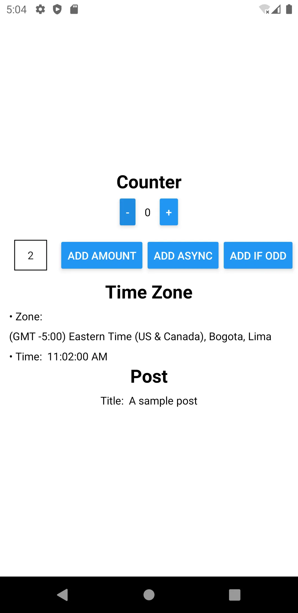

# React Native Metro Application for Redux
An example [React Native](https://reactnative.dev/) project for [Redux Toolkit](https://github.com/reduxjs/redux-toolkit) CI that runs [Detox](https://wix.github.io/Detox/) end-to-end tests against a [Metro bundler](https://facebook.github.io/metro/) build.

<div align="center">



</div>

## How to Setup Locally

1. Clone the project `git clone `
2. Install dependencies `pnpm install`
3. Setup a local [Pixel 3a API 30 Android Virtual Device](https://developer.android.com/studio/run/managing-avds).
4. Start the **Pixel 3a API 30 Virtual Device**
5. Install the release packages with `pnpm adb:install` (after virtual device has started)
6. Redirect ADB ports to local mock server with `pnpm adb:redirect`
7. Run tests `pnpm test`

After developing, to rerun the tests...

1. Build new APK apps with `pnpm build`
2. Install the release packages with `pnpm adb:install`
3. Run the tests: `pnpm test`

## Notes

### Jest Tests

The tests run with `jest` since Detox supplies _setup_ and _takedown_ scripts compatible with that tool. It might be possible to run with `vitest` with more experimentation and custom configurations/scripts.

### Android Device

The project uses Android emulation to run the Metro bundle. It is the most widely compatible for local development.

### GitHub MacOS Runner

Android Debug Bridge (ADB) service for emulation does _not_ reliably run on Ubuntu Linux (from experience); therefore, **MacOS** is the preferred runner. Not sure if it's due to how `reactivecircus/android-emulator-runner@v2` is setup or something else. 

### Self installing APK

Letting Detox handle the installation of the APK app on emulator results in the following error in the workflow...

```sh
ChildProcessError: '/Users/runner/Library/Android/sdk/platform-tools/adb -s emulator-5554 shell pm install -r -g -t /data/local/tmp/detox/Application.apk' failed with code null
```

The solution is to install the APK app in the emulator before running the Detox tests. This is the purpose of the `pnpm adb:install` and `pnpm adb:install:test` scripts.

### ADB Process Errors

In the GitHub Action workflow, there'll be a repeating output of...

```sh
/Users/runner/Library/Android/sdk/platform-tools/adb shell getprop sys.boot_completed
The process '/Users/runner/Library/Android/sdk/platform-tools/adb' failed with exit code 1
adb: device offline
```

This is normal. The action is waiting on the emulator to boot.

### Average Run Time

Without cache on the first run, the workflow takes about 30 - 40 minutes to complete. With all cache, the workflow takes about 10 - 15 minutes.
